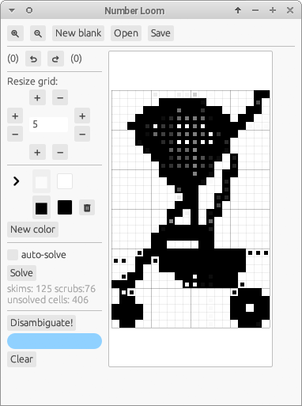

# `number-loom`

`number-loom` is a powerful tool for constructing puzzles variously known as "Nonograms", "Paint By Numbers", "Griddlers" (and many other names).



*Spot an uninvasive change that makes the solver able to solve the puzzle!*

It's still pretty janky, but it's also the most powerful such tool I know of. In particular, it can offer suggestions for how to make an unsolveable puzzle more solveable!  You can use it [in your browser](https://paul-stansifer.itch.io/number-loom), or install it on your own machine (see below).

## Features

* Supports the following file formats:
  * `webpbn`'s XML-based format (extension: `.xml` or `.pbn`)
  * The format used by the Olsak solver (extension: `.g`)
  * Images (typical extension: `.png`)
  * `char-grid`, a plaintext grid of characters, which it attempts to infer a reasonable character-to-color mapping (extension: `.txt`)
  * HTML, for export only, as a printable puzzle (extension `.html`)
* Has support for "Trianograms", a rare variation with triangular cells that may appear as caps to clues.
* A line-logic solver (currently not quite as powerful as it should be!) that provides some difficulty information.
* A tool that searches for one-cell edits that make puzzles closer to solveable.


## Installation and usage

`number-loom` can run in your browser! I've published it at https://paul-stansifer.itch.io/number-loom.

You can also install it to your machine if you're comfortable with the command line. The first step is to [install `cargo` through `rustup`](https://doc.rust-lang.org/cargo/getting-started/installation.html) if you haven't already.

Then run `cargo install number-loom`.

To open the gui: `number-loom` or `number-loom examples/png/keys.png --gui`.

To solve a puzzle from the command line, do `number-loom examples/png/hair_dryer.png`.  Adding `--disambiguate` will attempt to find disambiguations if it can't solve it.

To convert a puzzle from the command line, do `number-loom examples/png/hair_dryer.png /tmp/hair_dryer.xml`.  Use `--input-format` or `--output-format` if you want to explicitly select a format: `webpbn`, `olsak`, `image`, `char-grid`, or `html`. (The image format is still inferred from the filename.)

## Solver

The `number-loom` solver is a line-logic solver only. Algorithmically, it borrows a lot from `pbnsolve`, a powerful and fast nonogram solver, but `number-loom`'s heuristics for processing lines are intended to mimic human solver behavior rather than to maximize speed. (It also currently isn't as powerful as `pbnsolve`'s line-solver in `-aE` mode; this should be fixed!)

It has two modes:
  * "skim", which shoves all clues in a line as far as possible to one side and then the other, and checks to see if any of the clues overlap themselves between the two positions
  * "scrub", which tries each color for each cell in a line, ruling out any colors that cause a contradiction

It stores progress by noting each possibly-remaining color in each cell. Even though a human solver typically only notes down known cells, in my experience this corresponds pretty well to the sort of ad-hoc logic that solvers perform on color nonograms when they glance at the both lines that contain a cell.

Looking at the number of scrubs and skims can tell you something about the difficulty of a puzzle. Unless you're aiming for an easy puzzle, the solver should have to do some scrubs. If the number of scrubs is higher than the width plus the length, or the number of skims is more than five times that, it's starting to get tedious relative to the size of the puzzle. This is a *very* rough guide, though; the solver definitely doesn't measure difficulty completely accurately.

## GUI

The GUI is very basic, but you can

* Save and load
* Zoom in and out
* Adjust the size of the canvas from any side
* Add, remove, or recolor palette entries
* Solve the puzzle (it paints gray dots over unsolved cells), optionally automatically after each edit
* Disambiguate

### Disambiguation

This may take a little bit of time, but it's typically reasonably fast for puzzles under 40x40. Cells will be painted with an alternate color, with an opacity proportional to the number of unsolved cells that are resolved if that single cell is changed to that color. (It only ever displays one color, but there might be others that work just as well!)

It works by simply re-solving the puzzle with every possible one-square change. But it caches intermediate deductions to speed the process up. Typically, the more ambiguous the puzzle, the faster it is, so doing a guess-and-check with "auto-solve" turned on is a better way to hammer out the last few ambiguities.

## Trianograms

Trianograms are a rare variant. "Mindful Puzzle Books" publishes a book by that name. The Olšák solver also supports this variant, crediting the concept to "the journal Maľované krížovky, Silentium s.r.o, Bratislava", but I haven't been able to find out more. There are puzzles with triangles at [griddlers.net](http://griddlers.net/), but I'm not sure if they use the same rules.

A Trianogram has black, white, and four additional "colors": triangles that divide the cell into half-black and half-white. The triangles always serve as "caps" to a clue; for example "◢2◤" denotes that the four cells "◢■■◤" will appear. They will be consecutive, despite the fact that the caps are different "colors". Two consecutive clues will only be guaranteed to be separated by a space if neither of them is capped on the facing sides.

The Olšák solver, I believe, supports multi-color trianograms, but `number-loom` does not yet.

Only the `olsak` and `char-grid` formats can store trianograms.

## Usage with other solvers

### `pbnsolve`

You'll have to download and install `pbnsolve` [from a tarball] (and probably edit the `Makefile` to help it find `libxml2` -- under Ubuntu, you'll need to do `sudo apt install libxml2-dev`). Then (assuming it's on your `$PATH`):

[`pbnsolve`]: https://webpbn.com/pbnsolve.html
[from a tarball]: https://code.google.com/archive/p/pbnsolve/downloads

```
number-loom examples/png/stroller.png - --output-format webpbn | pbnsolve -tu
```

It gives some difficulty information. I believe that "Lines Processed" very roughly corresponds to `number-loom`'s measurement of skims and scrubs (summed together). But `pbnsolve` is currently more powerful for difficult puzzles. For example, it can solve the stroller puzzle, even if you use `-aE` to restrict it to line logic.


### The Olšák solver
The [Olšák solver] comes in a tarball and doesn't even have a makefile! (Just do `gcc grid.c -o grid` to build it.) It accepts a different input format. It does provide some difficulty information, but I haven't yet learned to understand it.

[Olšák solver]:  http://www.olsak.net/grid.html

```
number-loom examples/png/stroller.png - --output-format olsak | grid -
```